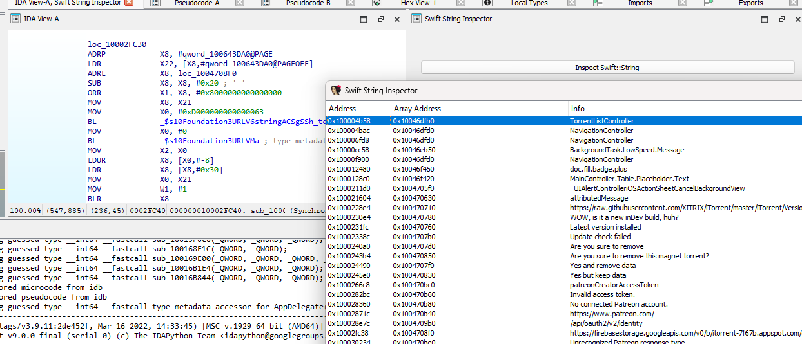
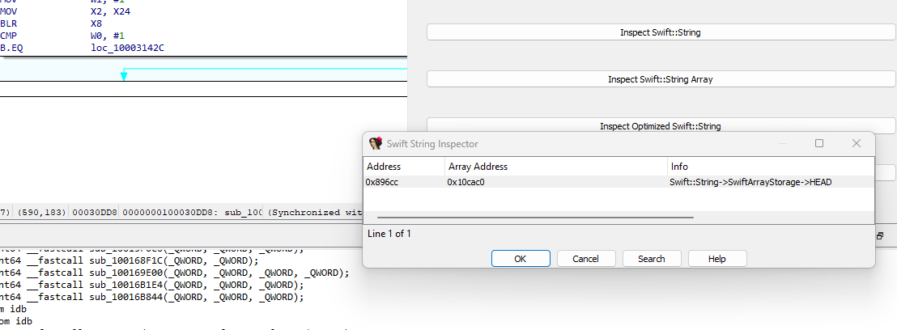
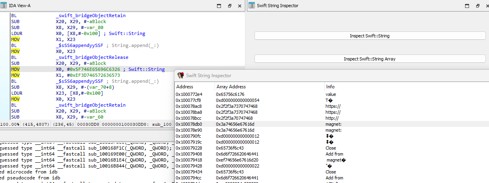

# Swift String Inspector Plugin

A simple plugin for working with Swift Strings, optimized Swift Strings, and Swift Arrays during the reverse engineering of iOS binaries in Hex-Rays IDA.

IDA struggles with handling Swift strings, although it works very well with name demangling, structs, and similar tasks. This plugin fixes that by quickly and easily correcting and retrieving each string reference, optimized strings, and string arrays present in the binary, even if they are not referenced, without complication.

Demo binary SHA256:
```d184be0752c3170243fad4ea851c90721c1102c1ea4d76f8bc39737cf5369bba``` 

##### Inspect Swift::String



##### Inspect Swift::String::Array



##### Inspect Optimized Swift::String



### Install

Drag the ```swift_string_inspector.py``` into the IDA Plugin folder.